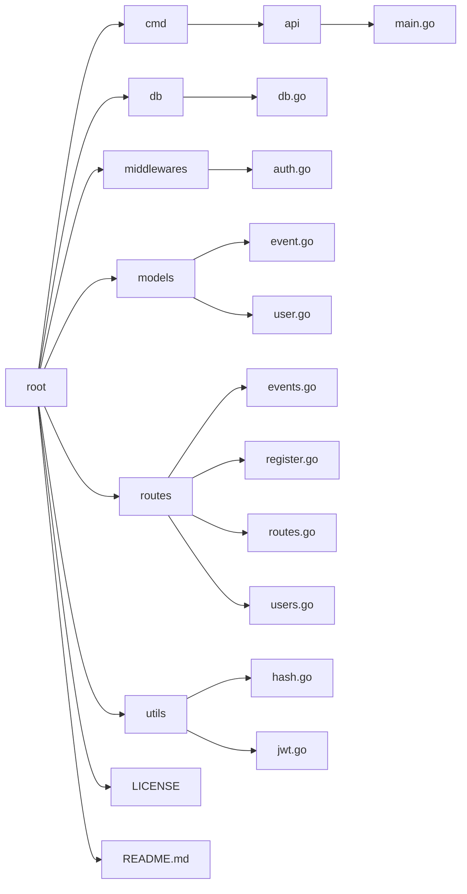

# REST API

My "Lorem Ipsum" implementation of a REST API with authentication, password hashing, and JSON web tokens.

## Project Directory Structure
Here's the directory structure of the project:

## License
This project is licensed under the [MIT License](LICENSE).