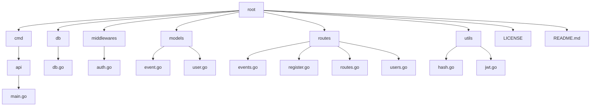

# My Lorem Ipsum Rest API 

Welcome to my "Ipsum Lorem" REST API! This project, named 'My Ipsum Lorem' REST API, is a fully functional demonstration of a REST API implementation. The term 'Ipsum Lorem' is a nod to the placeholder text commonly used in design and publishing, indicating that while the API is complete and functional, it lacks a specific real-world purpose or meaningful content. 

The project is an implementation of a REST API with authentication, JWT (JSON Web Token) support, password hashing, and CRUD (Create, Read, Update, Delete) operations. It utilizes an SQLite database for data storage.

## Project Structure

## Features 
- Implements a RESTful API with various routes for CRUD operations.
- Includes authentication middleware for secure access to endpoints. 
- Utilizes JWT for token-based authentication. 
- Provides password hashing for enhanced security. 
- Utilizes SQLite as the database backend.

## Usage
While I do not see any real reason to clone down the project other than to read its code, I will provide instructions on how to use it anyways. 

1. Clone the repository: git clone `https://github.com/mmclinton/events-rest-api`
2. Navigate to the project directory: `cd events-rest-api`
3. Install dependencies: `go mod tidy`
4. Build the project: `go build`
5. Run the executable: `./main`
6. Have fun!

## Contributing
If this ever reaches the public, please do not contribute. There will be no further updates to this project.

## License
This project is licensed under the [MIT License](LICENSE).
